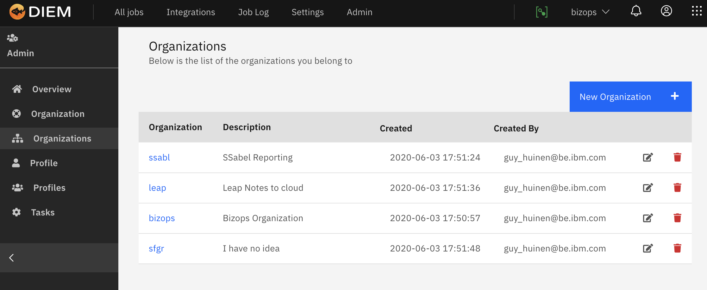
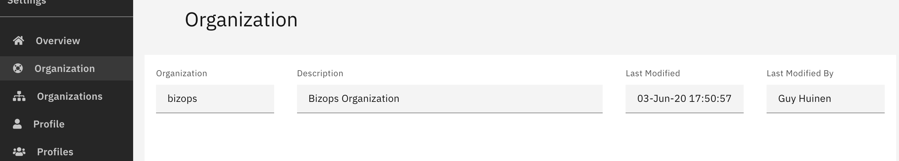

<!-- markdownlint-disable MD033 -->
# Organizations

> This section descrtibes the organizations in Diem

## Organization Overview

## Adding a new Organization

<ibm-notification id="notification-0" class="bx--inline-notification bx--inline-notification--warning" role="alert">

<i class="fas fa-exclamation-circle c-red mgl-10 mgr-5 fa-2x"></i>
This option is only available for the site admin

</ibm-notification>

The organization must be in lower case and try to keep it short

## Modifying an existing Organization

<i class="fas fa-info c-yellow mgr-5"></i>Only the description can change

## Deleting an organization

## Viewing Details

## Creating a new Organization

