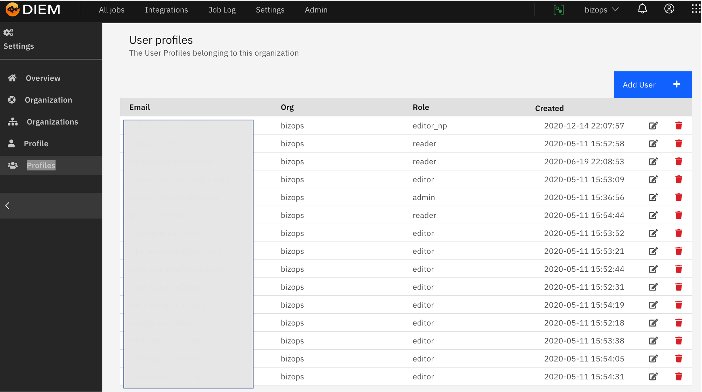
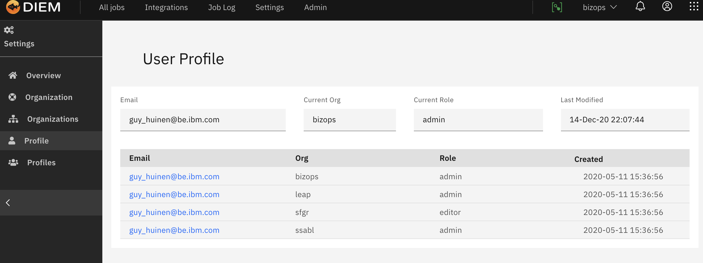

<!-- markdownlint-disable MD033 -->

# Profiles

> This section desctibes your profile within Diem

## Adding a Profile

### Profile Overview

### Creating a new Profile

### Modify an existing Profile

### Delete a existing Profile

### User Profile Overview

## Roles and access

### Roles are managed via a points system

| Role        | Field      | Nbr |
| ----------- | ---------- | --- |
| Admin       | admin      | 100 |
| Manager     | manager    | 80  |
| Editor      | editor     | 60  |
| DB Manager  | dbmanager  | 40  |
| Operator    | operator   | 20  |
| Depositor   | depositor  | 10  |
| Reader      | reader     | 5   |
| Org Manager | orgmanager | 1   |
| No Access   | noaccess   | 0   |

{.cds--data-table}

### Access Details

Manager (80)

- Add New Users
- Modify User Roleso
- Full Edit/view permissions

Editor (60)

- View and Edit All code (job code, snippets, templates, tags)
- View and Edit parameters (jobs, configmaps)
- View and Edit Job settings (email, scheduling)oRun/Stop jobs
- View all Logs
- Add and Download Files into the Files section
- View and Edit Connections, Webhooks, or API Keys
  - Note: Personal passwords entered by a user show as redacted for all other users.

DB Manager (40)

- View All Code (job code, snippets, templates, tags) but not be able to edit
- View and Edit Parameters (jobs, configmaps)
- View and Edit Job Settings (email, scheduling)
- Run/Stop JobsoView all Logs
- Add and Download Files into the Files Section
- View and Edit Connections, Webhooks, or API Keys

Operator (20)

- View All Code (job code, snippets, templates, tags) but not be able to edit
- View and Edit Parameters (jobs, configmaps)
- View and Edit Job Settings (email, scheduling)
- Run/Stop Jobs
- View all LogsoDownload Files in the Files Section but not add new ones
- No connection, webhook, or API Key Access

Depositor (10)

- No code access (job code, snippets, templates, tags)
- View and Edit Parameters (jobs, configmaps)
- View and Edit Job Settings (email, scheduling)
- Run/Stop Jobs
- View All Logs
- No access to Files Section
- No connection, webhook, or API Key Access

Reader (5)

- No code access (job code, snippets, templates, tags)
- View Parameters (jobs, configmaps) but cannot edit
- View Job Settings (email, scheduling) but cannot edit
- No job run/stop controloView All Logs
- No access to Files Section
- No connection, webhook, or API Key Access

Org Manager (1)

- Add New Users
- Modify User Roles
- View Logs
- No code access (job code, snippets, templates, tags)
- No parameter access (jobs, configmaps)
- No Job Settings access(email, scheduling)
- No job run/stop control
- No access to Files Section
- No connection, webhook, or API Key Access

NoAccess

- No view access of application. Addition security check required.

### Access Matrix

> site admin has full access (100)

N = No Access 
R = Read 
E = Edit or Perform Actions

| Role             | manager (80) | editor (60) | dbmanager (40) | operator (20) | depositor (10) | reader (5) | orgmanager (1) |
| ---------------- | ------------ | ----------- | -------------- | ------------- | -------------- | ---------- | -------------- |
| **Jobs**         |              |             |                |               |                |            |                |
| view             | E            | E           | E              | E             | R              | R          | R              |
| actions10        | E            | E           | E              | E             | N              | N          | N              |
| **Job Detail**   |              |             |                |               |                |            |                |
| general          | E            | E           | E              | E             | R              | R          | R              |
| code             | E            | E           | R              | R             | N              | N          | N              |
| parameters       | E            | E           | E              | E             | E              | R          | N              |
| actions          | E            | E           | E              | E             | E\*            | N          | N              |
| **Integrations** |              |             |                |               |                |            |                |
| connections      | E            | E           | E              | N             | N              | N          | N              |
| webhooks         | E            | E           | E              | N             | N              | N          | N              |
| api keys         | E            | E           | E              | N             | N              | N          | N              |
| files            | E            | E           | E              | R             | N              | N          | N              |
| config maps      | E            | E           | E              | E             | N              | N          | N              |
| tags             | E            | E           | E              | R             | N              | N          | N              |
| templates        | E            | E           | E              | R             | N              | N          | N              |
| code snippets    | E            | E           | E              | R             | N              | N          | N              |
| **Job Log**      |              |             |                |               |                |            |                |
| view             | R            | R           | R              | R             | R              | R          | R              |
| **Settings**     |              |             |                |               |                |            |                |
| Organizations    | R            | R           | R              | R             | R              | R          | R              |
| Organization     | E            | R           | R              | R             | R              | R          | E              |
| Profiles         | E            | R           | R              | R             | R              | N          | E              |
| Profile          | R            | R           | R              | R             | R              | R          | R              |

{.cds--data-table}

E\* limited to job start stop and edit document
