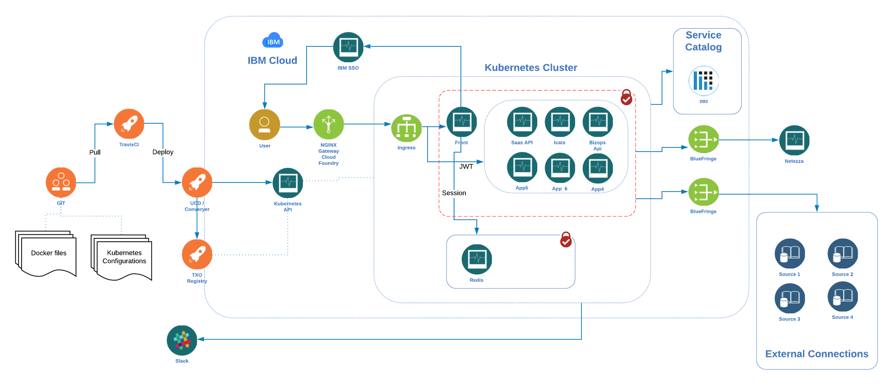

# Architecture

> This describes the general architecture of the application

## Hosted on IBM Cloud



## Containers and Packages

```cmd
>_ docker pull quay.io/diem/spark:base-spark-3.1.1 | base spark image | 3.1.1
```

| Image                       | Location                                               | version |
| --------------------------- | ------------------------------------------------------ | ------- |
| quay.io/diem/diem-core      | Diem Core                                              | latest  |
| quay.io/diem/nodepy         | Diem Nodepy                                            | latest  |
| quay.io/diem/diem-help      | Diem Help                                              | latest  |
| quay.io/diem/base-spark     | base spark image                                       | 3.1.1   |
| quay.io/diem/base-pyspark   | base pyspark image                                     | 3.1.0   |
| quay.io/diem/base-pyspark   | diem pyspark image                                     | 3.0.0   |
| quay.io/diem/base-pyspark   | diem pyspark image                                     | 3.1.1   |
| quay.io/diem/spark          | diem spark image                                       | 3.0.0   |
| quay.io/diem/spark          | diem spark image                                       | 3.1.1   |
| quay.io/diem/spark-operator | the operator image to be used with operator helm chart | 2.0.0   |

{.bx--data-table .bx--data-table2}

## Run Times

 |                                                             |     |
 | ----------------------------------------------------------- | --- |
 | [spark](../../../diem-help/docs/images/various/spark.png)   |     |
 | [python](../../../diem-help/docs/images/various/python.png) |     |

 {.bx--data-table .bx--data-table2}
