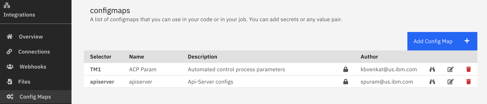

# Config Maps

> Config a very usefull to store secrets and configuration values

## Creating a new Config Map

## Update the Config Map

## Security for Config Maps

## Display of a protected Config Map

## Config Maps use YAML format

## Display of the security for the Config Map

- Lock closed : Personal and not viewable
- Lock open: your personal config map
- No Lock: available to the space

