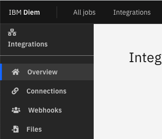
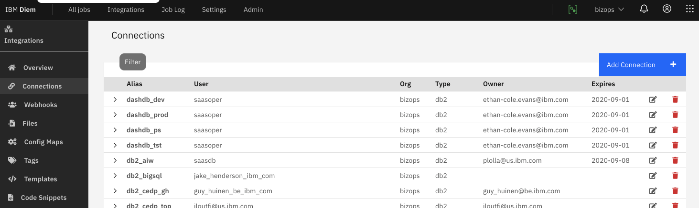
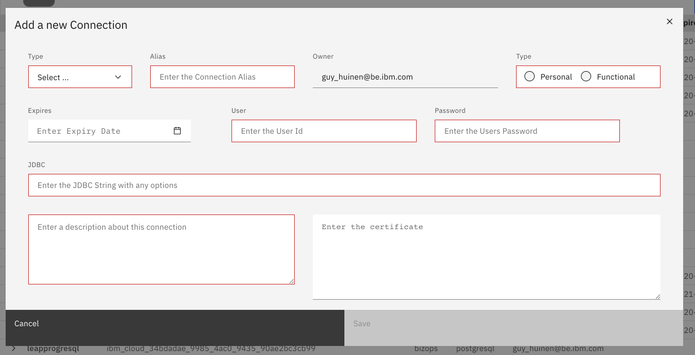

# Connections

> This describes how to view, create and edit connections

## Location

From the main panel select "Integrations"\
You can test it out



## Create a connection



## Fields



### Description Of Fields

| Function    | Required | Method                                                      |
| ----------- | -------- | ----------------------------------------------------------- |
| Type        | Yes      | Connection Type                                             |
| Alias       | Yes      | The Connection Alias, the most important field              |
| Type        | Yes      | Personal or Functional. Personal is hidden from other users |
| Expires     | No       | The expiry date of the user id                              |
| User        | Yes      | The Password                                                |
| Password    | Yes      | Password                                                    |
| JDBC        | Yes      | Valid JDBC String                                           |
| Description | No       | A description for this description                          |
| Certificate | No       | the certificate in clear text                               |

{.bx--data-table}

### More on JDBC

```python
jdbc:type://location:port/database:options;
jdbc:db2://db2w-qctrqnl.us-east.db2w.cloud.ibm.com:50001/BLUDB:sslConnection=true;
```

| Function | Method                                                     |
| -------- | ---------------------------------------------------------- |
| type     | jdbc driver type                                           |
| location | url of the connection !! hostname if public IP if internal |
| port     | port of the connection                                     |
| database | the name of the database                                   |
| options  | options that can be added<br?>sslConnection=true for ssl   |

{.bx--data-table}

! Make sure you use the right seperators for your db2 string eg ";" for db2

## Using in your Parameters section

```yaml
# Connections (Jobs)
# Connections can be used as follows
connections:
    - db2wh_etl
    - ssabl
    - progresql

using in your code: |
You can use the variables as follows:
1 directly as key replacement :db2wh_etl_username
2 or via access to the object like db2wh_etl['username']
```
