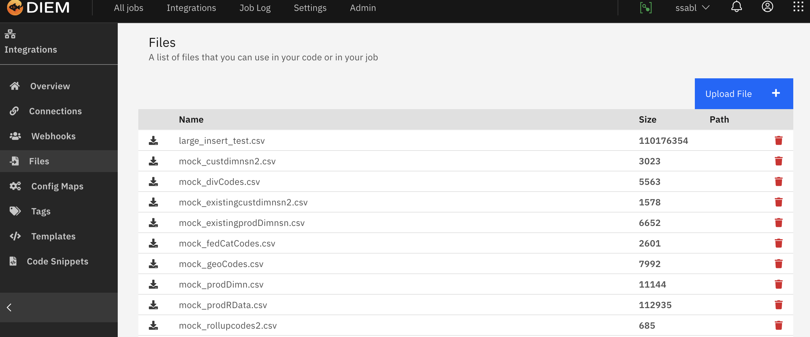

# Files

> This describes how you can use files, upload and download them.

## About Files

## Upload a file

## Download a file

## Delete a file

## See Also

File Handling in Job Types for using files in custom Jobs
