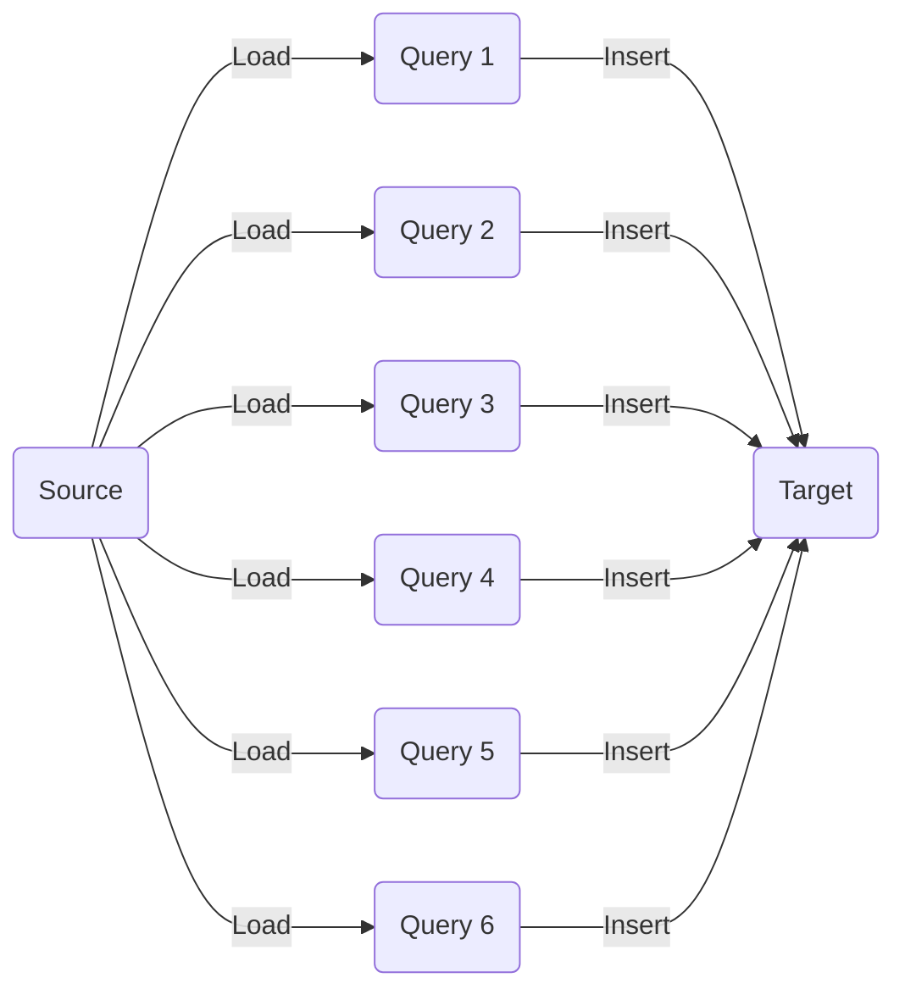

# Partitioning

> Atomic chunks of data (logical division of data) stored on a node in the Database / Cluster. Partitions are basic units of parallelism



## Partitioning in spark

For correct partitiong

-lowerbound
-upperbound
-number of partitions

### ROW_NUMBER() OVER

```sql
SELECT
  ROW_NUMBER() OVER (
    ORDER BY
      BMX_FLG,
      AS_A_SERV_FLG,
      MRR_DYNMCS_FLG
  ) AS PART,
  A.*
FROM
  STAGING.DIM_OFFERG_SST A
```

### DBPARTITIONNUM()

> Use this if your database is partitioned

```sql
SELECT
  DBPARTITIONNUM(DIV_CD) AS PART,
  A.*
FROM
  STAGING.DIM_OFFERG_SST A
```

### HASKEYVALUE

> Use this if your database is well distributed

```sql
SELECT
  HASHEDVALUE(CUST_ID) AS PART,
  *
FROM
  CLOUD2.DIM_CUST_SUM
```
