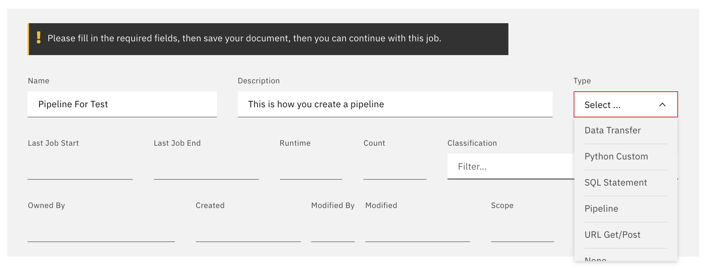
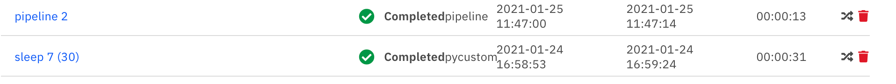
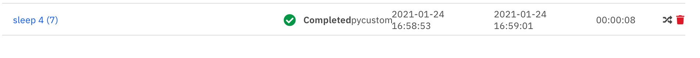

<!-- markdownlint-disable MD033 -->
# Pipelines

> This describes how to create a pipeline and add jobs to them.

## Creating a pipeline

## Adding Jobs to a Pipeline

## Creating a jobs workflow

In this example we will move the job sleep 7(30) after the job sleep # (6)

- Go Into edit mode
- select the job you want to move (sleep & (30))
- click on the move x icon

- All Jobs from the current pipeline will show up
- Select the job that will be the *parent*.
- You can select multiple jobs if needed
- Select if this job should be executed if all Parents are completed or may continue
- Press save

The Job is now moved as a child from sleep 3 (6)

## Removing Jobs from a pipeline

Click on the delete icon from the pipeline jobs. The chart will reorder itself

## About the pipeline status

| Action                      | Pipeline Status                                                                                                              | Job Status                                      |
| --------------------------- | ---------------------------------------------------------------------------------------------------------------------------- | ----------------------------------------------- |
| Starting the Pipeline       | Started                                                                                                                      | Pending                                         |
| Pipeline is running         | Running                                                                                                                      | Running based on flow                           |
| Pipeline is stopped         | Stopped                                                                                                                      | All Jobs will be stopped                        |
| One Pipeline Job Fails      | Pipeline continues to run until all jobs are finished and will be marked as failed                                           | All non failed jobs will continue to run        |
| One Pipeline job is stopped | Pipeline continues to run until all jobs are finished and will be marked as either failed if there's a failed job or stopped | All non stoppede jobs will continue to run      |
| One Pipeline job is started | Running                                                                                                                      | The pipeline will continue from the started Job |

{.bx--data-table}

## Pipeline Parameters

[See the Parameters section](/diem-help/param_pipeline)
