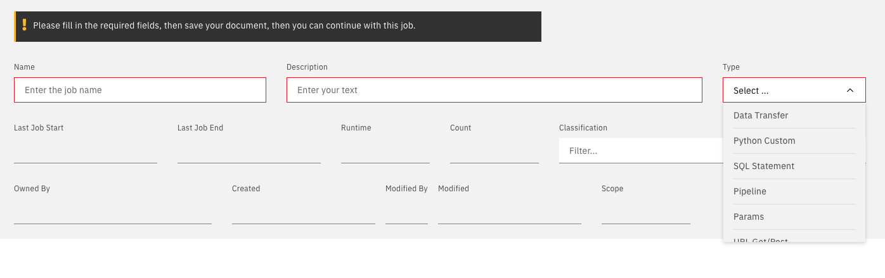

# Scala Jobs

> Run spark jobs written in Scala

## New Scala Job

From the main jobs panel create a new job and select Params



## Required Fields

In the params section

- create a paramater value "spark"
- Select type scala (type)
- Fill in the cloud object storage location (location)
- You only need the name of your bucket and the jar filename (mainclass)

```yml
spark:
  type: scala
  location: cos://diem-core-uat-mni.mycos/DataUser.jar
  mainclass: com.ibm.esil.es.mi.datauser.DataUser
```

```url
"cos://" +  name of your bucket + ".mycos/" + name of your jar file
cos://etl-mgr-poc.mycos/DataUser.jar
```

## Configuration

### Specify your Cloud Object Storage Location

- Create a configmap containing your cos credentials (see confimaps)
- for cos you need following 3 required fields

```yaml
# selector name: cospersonal
apiKeyId: Ndjfkdjfksjkkldsflkasdsdkfv
serviceInstanceId: "crn:v1:bluemix:public:cloud-object-storage:global:dlkfhksjhdvkkjj5767676767667::"
endpoint: s3.us-east.cloud-object-storage.appdomain.cloud
```

- Reference this configmap in the files flag of your parameters

```yaml
files:
  cos: cospersonal
```

### Add enviromental values

- Create a new configmap with some environmental values

```yaml
# selector name: scala_env_vars
db_name: test
db_user: db2user
db_password: hfdfhdsflasd
environment: UAT
```

- Include the configmap in your parameters config map

```yaml
configmaps:
  - scala_env_vars
```

> Your configmap values will be added to the POD environmental variables

## Further costomization

- Specify spark executors and cores
- specify a shared volume in case you want to store data

```yml
spark:
  volume: spark-shared-data
  driver:
    cores: 1
    memory: 8G
  executor:
    cores: 5
    memory: 8G
  instances: 2
  type: scala
  location: cos://diem-core-uat-mni.mycos/DataUser.jar
  mainclass: com.ibm.esil.es.mi.datauser.DataUser
  volume: true
  image:

```
