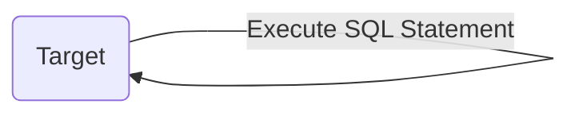
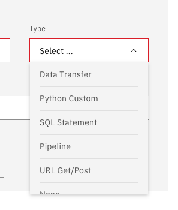
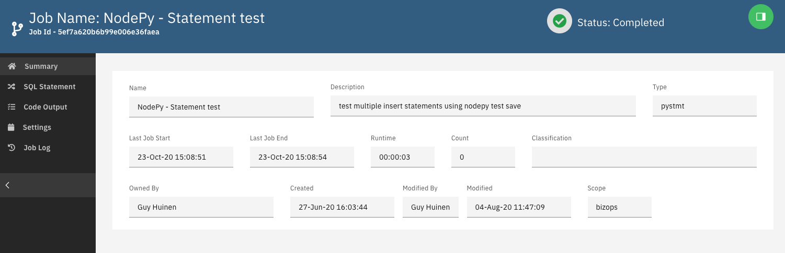
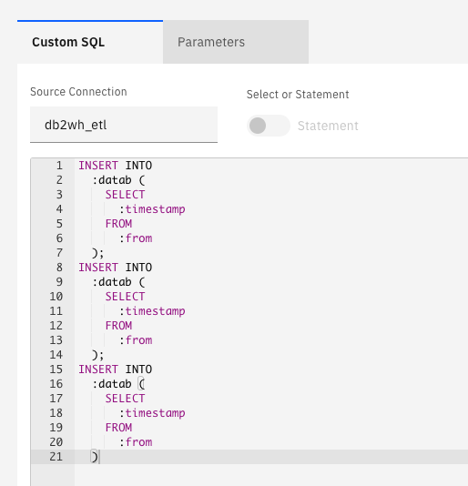

# Statement

> Run a SQL Query or execute a SQL Statement

## New Statement

From the main jobs panel create a new job and select SQL Statement

Fill in the main fields

Select your target and enter your sql

Add any parameter

