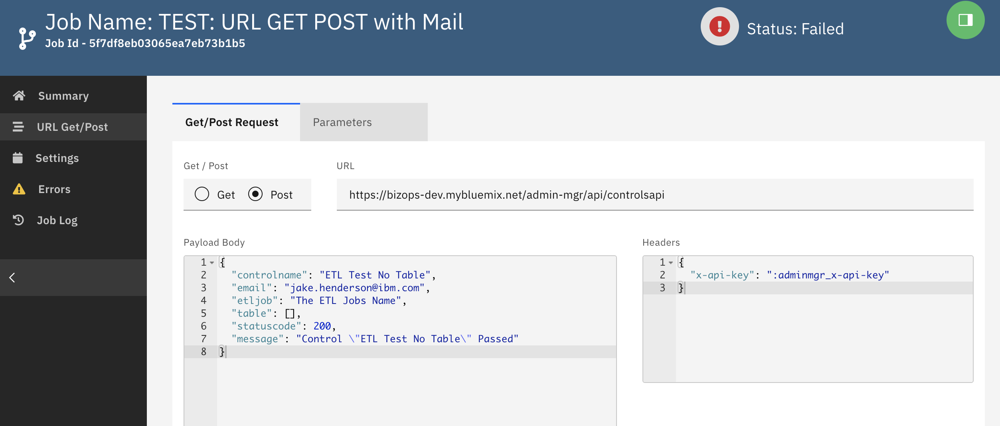

<!-- markdownlint-disable MD033 -->
# REST (Url Get and Post)

> Get or Post to any URL end point

## Creating a new Rest Request

From the All Jobs, create a new request and select "URLGetPost"

1. Select from the main screen whether this is a Get or a Post
2. Fill in the url
3. Fill in any header (otional)
4. Fill in your body (in case of a POST request)

## Parameters

You can include parameters (see paramters section) to use (secret) values

## Headers

You can add all allowed headers in json format. You can include parameters from config settings via the parameters section. *see parameters)

## Error Log

Any error with the request will be logged

## Output Log

The output of the rest request will be visible in the output log

