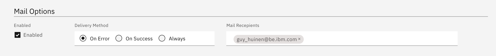

<!-- markdownlint-disable MD033 -->
# Parameters for Mail (Job Status) -mail

> This feature can be used for customizing mail sending options

These settings apply to the status of the job only. It can be used to sent a mail on the status of the job.

## Mail Options Location (Job Settings Tab)


## Mail Options Settings

<i class="fas fa-info c-green mgr-5"></i>Use this to send a mail in case of failure, success or both



- Enabled: Use this to enable or disable the mail sending of job status
- Delivery Method
  - On Error: only sent a mail if the job fails
  - On Success: Only sent the mail in case of successful completion
  - Always: Always sent a mail
- Mail recepients: List of recepients that will receive the mail

<i class="fas fa-info c-red mgr-5"></i>Don't forget to hit enter when adding a name, the field should become gray

## Examples of mail received

Success


Failure


## Optional Parameters for Job Mail Status

Sometimes you want to sent a custom body and subject in case a job failed. You can do this via the setting

```yml
mail:
  subject_success: Your access Manager report has completed
  subject_failure: Your access Manager report has failed
  content_success: '<div style="padding: 15px;margin:15px;border: 1px solid
    #c8d2d2;background:#dfe9e9;border-radius: 10px;">Your report has completed
    successfully</div>'
  content_failure: '<div style="padding: 15px;margin:15px;border: 1px solid
    #c8d2d2;background:#dfe9e9;border-radius: 10px;">Your report has errored,
    Please contact your admin</div>'
```

Success


Failure


