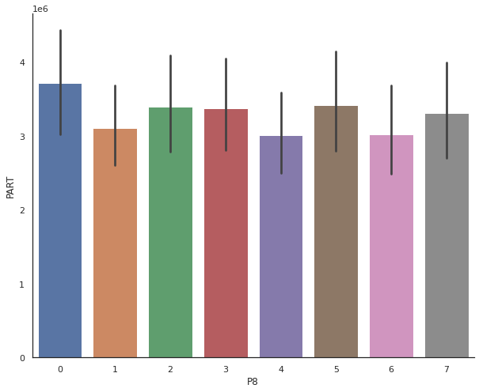

# DB2 Partitioning strategies

> A description of possible partitioning strategies

## SQL HASHEDVALUE Strategy

> The HASHEDVALUE function returns the distribution map index of the row obtained by applying the partitioning function on the distribution key value of the row.

[For more information](https://www.ibm.com/support/producthub/db2w/docs/content/SSCJDQ/com.ibm.swg.im.dashdb.sql.ref.doc/doc/r0000834.html)

### Finding out if a table is distributed

data taken from rndom table SASR2.FCT_MRR_ARR_SUM_V2_IC with 26.320.825 rows

Current transfer time using 24 partitions was taking 3762 seconds or one hour and 3 minutes

```sql
SELECT
  HASHEDVALUE(YR) AS RID,
  A.*
FROM
  SASR2.FCT_MRR_ARR_SUM_V2_ICN A
```

### Verify the max hash value in the db

```sql
SELECT
  max(HASHEDVALUE(MTH)) AS PART
FROM
  SASR2.FCT_MRR_ARR_SUM_V2_ICN for read ONLY WITH ur

32762 <- not the maximum
```

- If this number is 0 , means the table not distributed
- if it is 32767 then it has the maximum distribution

In an ideal situation we should have 26.320.825 / 32767 = 803 equally devided partitions

### Looking at a distibution map

```sql
SELECT *
FROM (
    SELECT HASHEDVALUE(MTH)
        ,count(*) AS PART
    FROM SASR2.FCT_MRR_ARR_SUM_V2_ICN
    GROUP BY HASHEDVALUE(MTH)
    ORDER BY 1
    )
FOR READ ONLY
WITH ur
```

When we display the first 10 rows we can already see that categories are missing

```text
part count
0    33025
2    10
4    5
6    10
8    1045
12    40935
17    8475
19    3105
22    10
27    495
```

### Distribution Statistics

|       |       1 |    PART |
| :---- | ------: | ------: |
| count |    9129 |    9129 |
| mean  | 15285.8 | 2883.21 |
| std   | 9535.22 | 9411.19 |
| min   |       0 |       5 |
| 25%   |    7047 |      25 |
| 50%   |   14797 |     210 |
| 75%   |   22878 |    1245 |
| max   |   32762 |  156230 |

{.cds--data-table}

This might be a problem:

- we have not the full 32767 count
- we only have 9129 rows filled
- The mean is off to the 803 optimal records
- There is a hight standard variation

### visualy explained

This is the distribution of data when 8 partitions are used



## Optimization strategy

### Find optimal columns

you can use this method to use the most optimal distribution

```sql
SELECT colname
    ,colcard
FROM syscat.columns
WHERE trim(tabschema) || '.' || trim(tabname) = 'SASR2.FCT_MRR_ARR_SUM_V2_ICN'
ORDER BY colcard DESC

FETCH FIRST 4 ROWS ONLY
```

### Create table using new distribution

```sql
 DISTRIBUTE BY HASH("TMRR_YTY_CHANGE","TMRR_NET_CHURN_CHANGE_YTY","TMRR_CURR_MTH_REVN")
```

### Runstats

when your data is loaded don't forget to run a runstats

```sql
CALL SYSPROC.ADMIN_CMD('runstats on table staging.FCT_MRR_ARR_SUM_V2_ICN WITH DISTRIBUTION');
```

### Examine new distribution

```txt
0 211
1 183
2 324
3 149
4 355
5 185
6 2004
7 244
8 546
9 180
```

data already look better distributed

### statistics

|       |       1 |    PART |      P8 |     P15 |
| :---- | ------: | ------: | ------: | ------: |
| count |   32768 |   32768 |   32768 |   32768 |
| mean  | 16383.5 | 803.248 |     3.5 |       7 |
| std   | 9459.45 | 253.822 | 2.29132 | 4.32063 |
| min   |       0 |     510 |       0 |       0 |
| 25%   | 8191.75 |     725 |    1.75 |       3 |
| 50%   | 16383.5 |     775 |     3.5 |       7 |
| 75%   | 24575.2 |     825 |    5.25 |      11 |
| max   |   32767 |    6720 |       7 |      14 |

{.cds--data-table}

his is a better partitiong

- we have the full 32767 count (pandas index starts at 0)
- The mean is on top of the best distribution
- There is a hight standard variation is very high wich is good

"RID" < 2183 or "RID" is null, "RID" >= 2183 AND "RID" < 4366, "RID" >= 4366 AND "RID" < 6549, "RID" >= 6549 AND "RID" < 8732, "RID" >= 8732 AND "RID" < 10915, "RID" >= 10915 AND "RID" < 13098, "RID" >= 13098 AND "RID" < 15281, "RID" >= 15281 AND "RID" < 17464, "RID" >= 17464 AND "RID" < 19647, "RID" >= 19647 AND "RID" < 21830, "RID" >= 21830 AND "RID" < 24013, "RID" >= 24013 AND "RID" < 26196, "RID" >= 26196 AND "RID" < 28379, "RID" >= 28379 AND "RID" < 30562, "RID" >= 30562
2

20/12/10 18:15:09 INFO JDBCRelation: Number of partitions: 8, WHERE clauses of these partitions: "RID" < 4094 or "RID" is null, "RID" >= 4094 AND "RID" < 8188, "RID" >= 8188 AND "RID" < 12282, "RID" >= 12282 AND "RID" < 16376, "RID" >= 16376 AND "RID" < 20470, "RID" >= 20470 AND "RID" < 24564, "RID" >= 24564 AND "RID" < 28658, "RID" >= 28658


