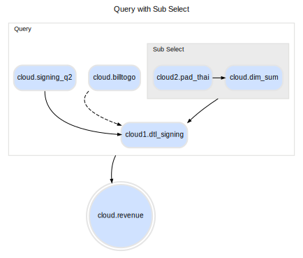
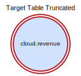
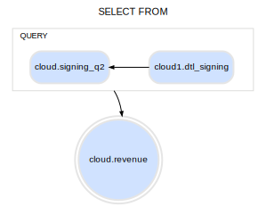
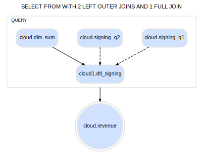
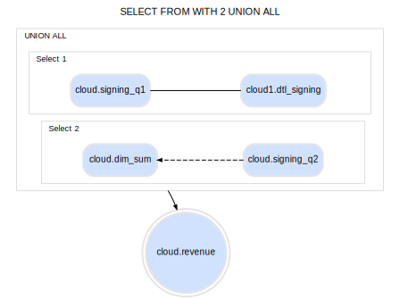
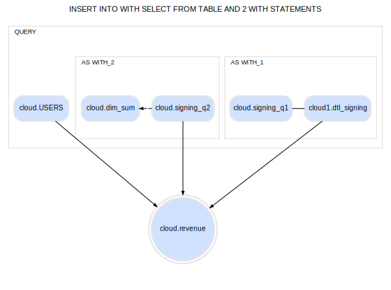
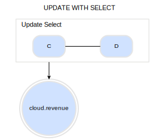
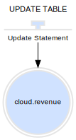

# GraphViz

```python
#pip install diagrams
```

```python
from graphviz import Source
```

## Data Modeling

> A initial set up to come up with a series of diagrams that can express SQL queries

## SQL Types to draw

* select from
* select into
* update table set
* insert into
* union all
* subselect
* with statement
* truncate
* delete from
* union all

## Conventions

* solid line: join
* dotted line: LR outer join

## Links

[https://www.graphviz.org/](https://www.graphviz.org/)
[https://www.graphviz.org/pdf/dotguide.pdf](https://www.graphviz.org/pdf/dotguide.pdf)
[https://graphviz.readthedocs.io/en/stable/manual.html](https://graphviz.readthedocs.io/en/stable/manual.html)

***

### Query with Sub Select

```python
src = """
digraph {
    label="Query with Sub Select"

    # graph settings
    compound=true
    ratio=0.8
    style="solid"
    color= "#DDDDDB"
    fontname=Arial
    fontsize=11
    labelloc=t

    # node settings
    node [
        color= "#e5e5e5"
        fillcolor="#d0e2ff"
        shape=box
        style="filled,radial,bold,rounded"
        fontname=Arial
        fontsize=10
      ]

    #edge setting
    edge [
      arrowsize=0.5
      ]

    A [label="cloud.revenue" shape=doublecircle]
    B [label="cloud1.dtl_signing"]
    C [label="cloud.dim_sum"]
    D [label="cloud2.pad_thai"]
    E [label="cloud.billtogo"]
    F [label="cloud.signing_q2"]


    subgraph cluster_1 {

        fontsize=9
        labeljust=l

        label="Query"

        F:s -> B [constraint=false]

        subgraph cluster_2 {

            # subgraph styling
            style="filled,solid"
            color= "#DDDDDB"
            fillcolor="#EBEBEB"
            label="Sub Select"

            D -> C [constraint=false]
        }

        C -> B:ne [ltail=cluster_2]
        E:sw -> B [style=dashed]

    }

    B:sw -> A [ltail=cluster_1]

}
"""
f= Source(src)
f
```



***

### Target Table Truncated

```python
src = """
digraph {

    fontsize=11

    label="Target Table Truncated"

    # graph settings
    fontname=Arial
    labelloc=t

    # node settings
    node [
        color= "#ba1b23"
        fillcolor="#d0e2ff"
        shape=doublecircle
        style="filled,bold"
        fontname=Arial
        fontsize=10
      ]

    T [label="cloud.revenue"]
}
"""
f= Source(src)
f
```



***

### INSERT INTO TABLE

```python
src = """
digraph {

    fontsize=11

    label="INSERT INTO TABLE"

    # graph settings
    fontname=Arial
    labelloc=t

    # node settings
    node [
        color= "#e5e5e5"
        fillcolor="#d0e2ff"
        shape=doublecircle
        style="filled,bold"
        fontname=Arial
        fontsize=10
      ]

    T [label="cloud.revenue"]
    B [label="cloud1.dtl_signing" shape=box]
    B -> T
}
"""
f= Source(src)
f
```


***

### SELECT FROM

```python
src = """
digraph {
    label="SELECT FROM"

    # graph settings
    compound=true
    ratio=0.7
    style="solid"
    color= "#DDDDDB"
    fontname=Arial
    labelloc=t
    fontsize=11

    # node settings
    node [
        color= "#e5e5e5"
        fillcolor="#d0e2ff"
        shape=box
        style="filled,radial,bold,rounded"
        fontname=Arial
        fontsize=10
      ]

    #edge setting
    edge [
      arrowsize=0.5
      ]

    T [label="cloud.revenue" shape=doublecircle]
    A [label="cloud1.dtl_signing"]
    B [label="cloud.signing_q2"]


    subgraph cluster_1 {

        fontsize=9
        labeljust=l

        label="QUERY"

        A -> B [constraint=false]

    }

    B:se -> T [ltail=cluster_1]

}
"""
f= Source(src)
f
```



***

### SELECT FROM WITH 2 LEFT OUTER JOINS AND 1 FULL JOIN

```python
src = """
digraph {
    label="SELECT FROM WITH 2 LEFT OUTER JOINS AND 1 FULL JOIN"

    # graph settings
    compound=true
    ratio=0.7
    style="solid"
    color= "#DDDDDB"
    fontname=Arial
    labelloc=t
    fontsize=11

    # node settings
    node [
        color= "#e5e5e5"
        fillcolor="#d0e2ff"
        shape=box
        style="filled,radial,bold,rounded"
        fontname=Arial
        fontsize=10
      ]

    #edge setting
    edge [
      arrowsize=0.5
      ]

    T [label="cloud.revenue" shape=doublecircle]
    A [label="cloud1.dtl_signing"]
    B [label="cloud.signing_q1"]
    C [label="cloud.signing_q2"]
    D [label="cloud.dim_sum"]


    subgraph cluster_1 {

        fontsize=9
        labeljust=l

        label="QUERY"

        B -> A [style=dashed]
        C -> A [style=dashed]
        D -> A

    }

    A:s -> T [ltail=cluster_1 ]

}
"""
f= Source(src)
f
```



***

### SELECT FROM WITH 2 UNION ALL

```python
src = """
digraph {
    label="SELECT FROM WITH 2 UNION ALL"

    # graph settings
    compound=true
    ratio=0.7
    style="solid"
    color= "#DDDDDB"
    fontname=Arial
    labelloc=t
    fontsize=11

    rankdir=TB

    # node settings
    node [
        color= "#e5e5e5"
        fillcolor="#d0e2ff"
        shape=box
        style="filled,radial,bold,rounded"
        fontname=Arial
        fontsize=10
      ]

    #edge setting
    edge [
      arrowsize=0.5
      ]

    T [label="cloud.revenue" shape=doublecircle]
    A [label="cloud1.dtl_signing"]
    B [label="cloud.signing_q1"]
    C [label="cloud.signing_q2"]
    D [label="cloud.dim_sum"]


    subgraph cluster_1 {

        fontsize=9
        labeljust=l

        label="UNION ALL"

        subgraph cluster_1A {

            fontsize=9
            labeljust=l

            label="Select 1"

            A -> B [constraint=false arrowhead=none]

        }

        subgraph cluster_1B {

            fontsize=9
            labeljust=l

            label="Select 2"

            C -> D [style=dashed constraint=false]

        }

    }

    edge[ style = invis ];
    A  -> C;

    D:se -> T [ltail=cluster_1 style=solid ]

}
"""
f= Source(src)
f
```



***

### INSERT INTO WITH SELECT FROM TABLE AND 2 WITH STATEMENTS

```python
src = """
digraph {

    ratio=0.7
    style="solid"
    color= "#DDDDDB"
    fontname=Arial
    labelloc=t
    fontsize=11
    rankdir=TB

    label="INSERT INTO WITH SELECT FROM TABLE AND 2 WITH STATEMENTS"

    # node settings
    node [
        color= "#e5e5e5"
        fillcolor="#d0e2ff"
        shape=box
        style="filled,radial,bold,rounded"
        fontname=Arial
        fontsize=10
      ]

    #edge setting
    edge [
      arrowsize=0.5
      ]

    T [label="cloud.revenue" shape=doublecircle]
    A [label="cloud1.dtl_signing"]
    B [label="cloud.signing_q1"]
    C [label="cloud.signing_q2"]
    D [label="cloud.dim_sum"]


    subgraph cluster_1 {

        fontsize=9
        labeljust=l

        label="QUERY"

        E [label="cloud.USERS"]

        subgraph cluster_1A {

            fontsize=9
            labeljust=l

            label="AS WITH_1"

            A -> B [constraint=false arrowhead=none]

        }

        subgraph cluster_1B {

            fontsize=9
            labeljust=l

            label="AS WITH_2"

            C -> D [style=dashed constraint=false]

        }

    }


    { A,C, E} -> T [ltail=cluster_1 style=solid ]

}
"""
f= Source(src)
f
```



***

#### Update statement with select

```python
src = """
digraph {

    label="UPDATE WITH SELECT"

    fontsize=11

    # graph settings
    compound=true
    ratio=0.8
    style="solid"
    color= "#DDDDDB"
    fontname=Arial
    fontsize=11
    labelloc=t

    # node settings
    node [
        color= "#e5e5e5"
        fillcolor="#d0e2ff"
        shape=box
        style="filled,radial,bold,rounded"
        fontname=Arial
        fontsize=10
      ]

    #edge setting
    edge [
      arrowsize=0.5
      ]

    T [label="cloud.revenue" shape=doublecircle]

    subgraph cluster_1 {

            # subgraph styling
            style="solid"
            color= "#DDDDDB"
            label="Update Select"
            labeljust=l

            D -> C [constraint=false arrowhead=none]
        }

    C -> T [ltail=cluster_1 arrowhead=vee]
}
"""
f= Source(src)
f
```



***

#### Update with statement

```python
src = """
digraph {

    fontsize=11

    label="UPDATE TABLE"

    # graph settings
    fontname=Arial
    labelloc=t

    # node settings
    node [
        color= "#e5e5e5"
        fillcolor="#d0e2ff"
        shape=doublecircle
        style="filled,bold"
        fontname=Arial
        fontsize=10
      ]

    T [label="cloud.revenue"]
    B [label="Update Statement" shape=terminator labelloc="b"]
    B -> T
}
"""
f= Source(src)
f
```


