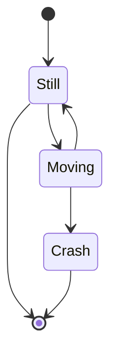
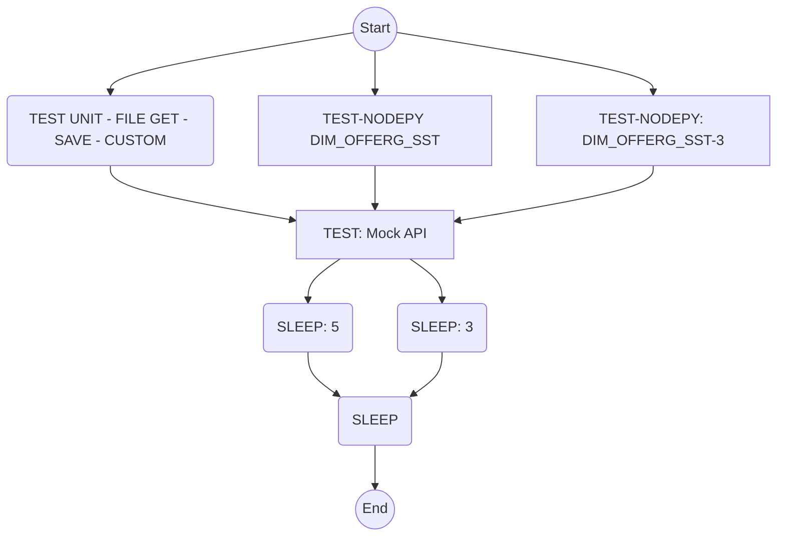
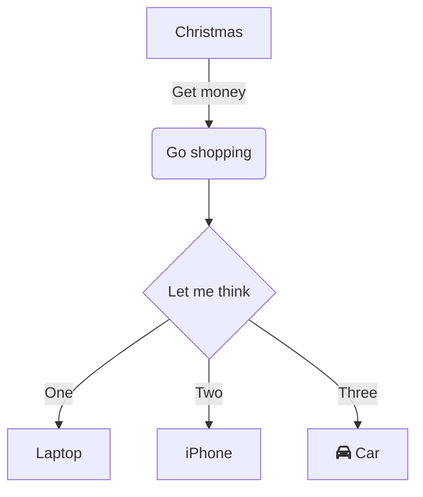

# Mermaid Diagrams

> Mermaid Diagrams are being used by Diem to represent flows

## State Diagram



## Flowcharts

An easy way to add a flowchart to have your code generated is using the method below

First Declare your names and then generate the flow

example of some styles you can apply

- monotoneX
- monotoneY
- simple

```txt
graph TD
%% Set edges to be curved (try monotoneX for a nice alternative)
%%{init:{'flowchart':{'nodeSpacing': 20, 'rankSpacing': 40}}}%%
linkStyle default interpolate basis
A((Start)):::someclass
B(TEST UNIT - FILE GET - SAVE - CUSTOM)
C[TEST-NODEPY DIM_OFFERG_SST]
D[TEST-NODEPY: DIM_OFFERG_SST-3]
E[TEST: Mock API]
F(SLEEP: 5)
G(SLEEP: 3)
H(SLEEP)
I((End))
A-->B
A-->C
A-->D
B-->E
C-->E
D-->E
E-->F
E-->G
F-->H
G-->H
H-->I
```

This will generate



## Graph


